# Database Schema Documentation

Dokumentasi ini menjelaskan struktur database (PostgreSQL) yang digunakan dalam project **Desaku Digital**. Project ini menggunakan Prisma sebagai ORM.

## Entity Relationship Diagram (ERD)

```mermaid
erDiagram
    User {
        Int id PK
        String name
        String email UK
        String password
        Role role "Default: USER"
        DateTime createdAt
    }
    
    News {
        Int id PK
        String title
        String content
        String image "Nullable"
        DateTime createdAt
    }
    
    ServiceRequest {
        Int id PK
        Int userId
        String type
        String status "Default: PENDING"
        DateTime createdAt
    }
    
    Product {
        Int id PK
        String name
        String description
        Int price
        String image "Nullable"
        String whatsapp
    }
    
    VillageProfile {
        Int id PK
        String name
        String about
        String vision
        String mission
        String address
        String image "Nullable"
        DateTime createdAt
    }
    
    Gallery {
        Int id PK
        String title "Nullable"
        String image
        DateTime createdAt
    }
    
    Umkm {
        Int id PK
        String name
        String description
        String whatsapp
        String address
        String image "Nullable"
        DateTime createdAt
    }
    
    Surat {
        Int id PK
        String nama
        String nik
        String jenis
        String keperluan
        String status "Default: DIPROSES"
        DateTime createdAt
    }
```

## Enum Definition

### `Role`
Digunakan pada tabel `User` untuk menentukan tingkat otorisasi.
- `ADMIN`: Akses penuh ke seluruh fitur CMS (Create, Update, Delete).
- `USER`: Akses standar (end-user/warga), bisa melakukan read dan submit data pengajuan.

---

## Tabel Detail

### 1. `User`
Tabel untuk menyimpan data autentikasi pengguna aplikasi dan CMS.
| Field | Type | Modifiers | Description |
|-------|------|-----------|-------------|
| `id` | `Int` | `@id @default(autoincrement())` | Primary key |
| `name` | `String` | | Nama lengkap user |
| `email` | `String` | `@unique` | Email untuk login |
| `password` | `String` | | Password (hashed) |
| `role` | `Role` | `@default(USER)` | Role pengguna |
| `createdAt` | `DateTime` | `@default(now())` | Tanggal registrasi |

### 2. `News`
Tabel untuk menyimpan artikel berita desa.
| Field | Type | Modifiers | Description |
|-------|------|-----------|-------------|
| `id` | `Int` | `@id @default(autoincrement())` | Primary key |
| `title` | `String` | | Judul berita |
| `content` | `String` | | Isi berita |
| `image` | `String` | `?` (Nullable) | Nama file gambar thumbnail |
| `createdAt` | `DateTime` | `@default(now())` | Tanggal publikasi |

### 3. `VillageProfile`
Tabel untuk menyimpan data profil desa (idealnya hanya 1 record).
| Field | Type | Modifiers | Description |
|-------|------|-----------|-------------|
| `id` | `Int` | `@id @default(autoincrement())` | Primary key |
| `name` | `String` | | Nama Desa |
| `about` | `String` | | Sejarah singkat / Tentang |
| `vision` | `String` | | Visi desa |
| `mission` | `String` | | Misi desa |
| `address` | `String` | | Alamat lengkap kantor balai desa |
| `image` | `String` | `?` (Nullable) | Nama file foto/logo desa |
| `createdAt` | `DateTime` | `@default(now())` | Tanggal data diubah |

### 4. `Gallery`
Tabel untuk menyimpan dokumentasi foto kegiatan desa.
| Field | Type | Modifiers | Description |
|-------|------|-----------|-------------|
| `id` | `Int` | `@id @default(autoincrement())` | Primary key |
| `title` | `String` | `?` (Nullable) | Judul kegiatan/foto |
| `image` | `String` | | Nama file foto |
| `createdAt` | `DateTime` | `@default(now())` | Tanggal foto diunggah |

### 5. `Umkm`
Tabel katalog UMKM (Usaha Mikro Kecil Menengah) desa.
| Field | Type | Modifiers | Description |
|-------|------|-----------|-------------|
| `id` | `Int` | `@id @default(autoincrement())` | Primary key |
| `name` | `String` | | Nama UMKM / Produk |
| `description` | `String`| | Deskripsi usaha |
| `whatsapp` | `String` | | Nomor WA (CTH: 628...) |
| `address` | `String` | | Lokasi/Alamat UMKM |
| `image` | `String` | `?` (Nullable) | Nama file foto produk |
| `createdAt` | `DateTime` | `@default(now())` | Tanggal data dimasukkan |

### 6. `Surat`
Tabel untuk menampung pengajuan persuratan dari warga.
| Field | Type | Modifiers | Description |
|-------|------|-----------|-------------|
| `id` | `Int` | `@id @default(autoincrement())` | Primary key |
| `nama` | `String` | | Nama lengkap pemohon |
| `nik` | `String` | | NIK pemohon |
| `jenis` | `String` | | Jenis surat (Domisili, dll) |
| `keperluan` | `String` | | Deskripsi keperluan surat |
| `status` | `String` | `@default("DIPROSES")`| Diproses / Selesai / Ditolak |
| `createdAt` | `DateTime` | `@default(now())` | Tanggal pengajuan dibuat |

### 7. `Product` & `ServiceRequest`
*(Tabel legacy / unused dalam flow CMS terbaru, dipertahankan untuk kompatibilitas mundur/fitur masa depan)*
- `Product`: Mirip dengan Umkm namun memiliki field `price` dan tidak memiliki `address`.
- `ServiceRequest`: Mirip dengan `Surat` namun berbasis ID User dan `status` bahasa inggris (`PENDING`).
